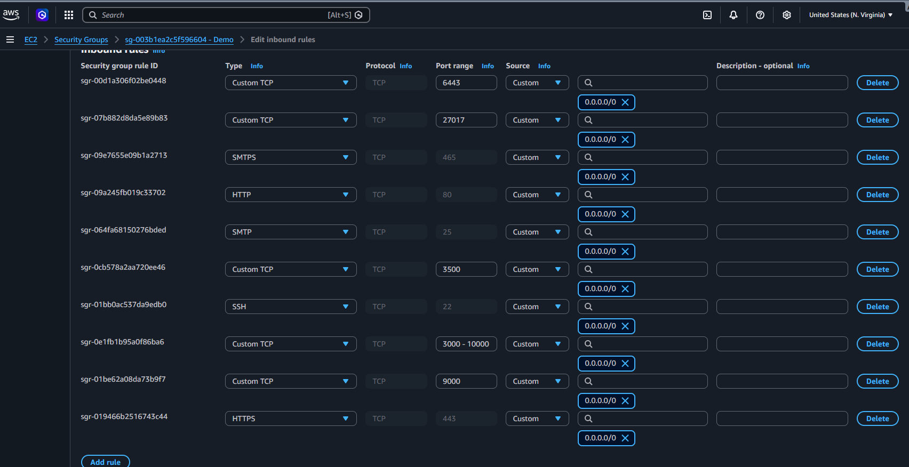
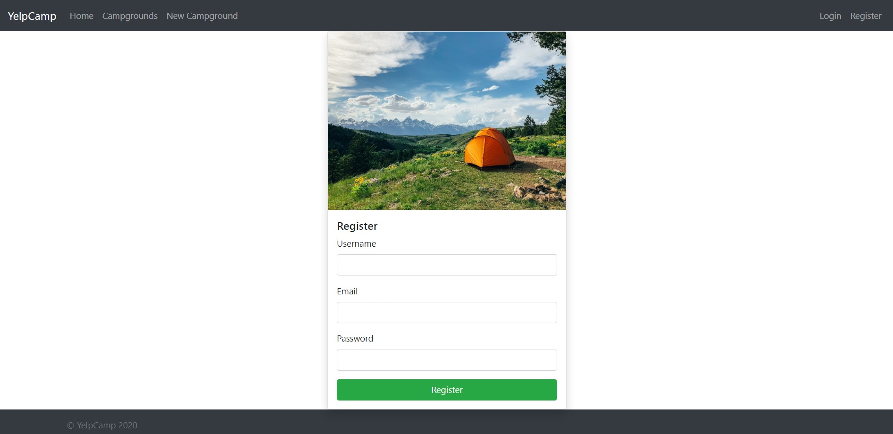

# Yelp Camp Web Application

This web application allows users to add, view, access, and rate campgrounds by location. It is based on "The Web Developer Bootcamp" by Colt Steele, but includes several modifications and bug fixes. The application leverages a variety of technologies and packages, such as:

- **Node.js with Express**: Used for the web server.
- **Bootstrap**: For front-end design.
- **MongoDB Atlas**: Serves as the database.
- **Passport package with local strategy**: For authentication and authorization.
- **Cloudinary**: Used for cloud-based image storage.
- **Helmet**: Enhances application security.
- ...

## Setup Instructions

To get this application up and running, you'll need to set up accounts with Cloudinary, Mapbox, and MongoDB Atlas. Once these are set up, create a `.env` file in the same folder as `app.js`. This file should contain the following configurations:

```sh
CLOUDINARY_URL=[Cloudinary Base URL]
CLOUDINARY_CLOUD_NAME=[Cloudinary Name]
CLOUDINARY_KEY=[Cloudinary Key]
CLOUDINARY_SECRET=[Cloudinary Secret]
MAPBOX_TOKEN=[Your Mapbox Token]
DB_URL=[Your MongoDB Atlas Connection URL]
SECRET=[Your Chosen Secret Key] # This can be any value you prefer
```

## Deployments steps:
1. Launch two instances: one for Jenkins and one for SonarQube.
2. In the deployments/scripts folder, run the script on the respective server.
3. Add the Security groups inbound traffic:
    
4. Log in to Jenkins and install the following plugins:
        NodeJS, Docker pipeline, SonarQube Scanner, Kubernetes, Kubernetes CLI
5. In the SonarQube instance, generate a token for accessing sonar qube server
6. In Manage Jenkins, create Jenkins credentials for SonarQube token , Docker login , and .env file.
7. Create Jenkins jobs with the pipeline option for different environments (Dev & prod), and paste the pipeline script located under the pipelines.
8. Then save & build the job.
9. After succesfully execute the pipeline, then access your app instance at your public ip with port 3000.


## Application Screenshots


